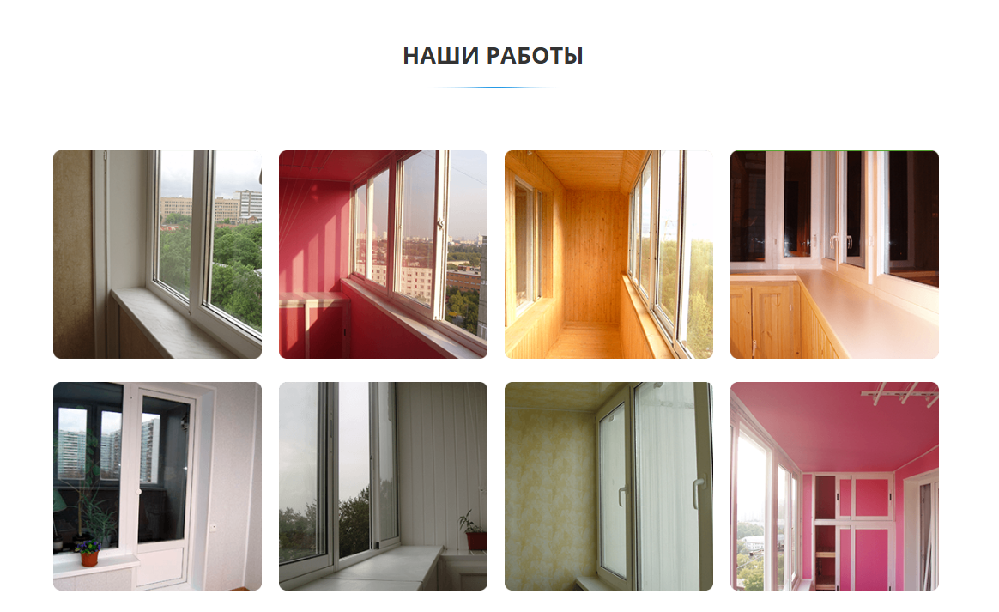
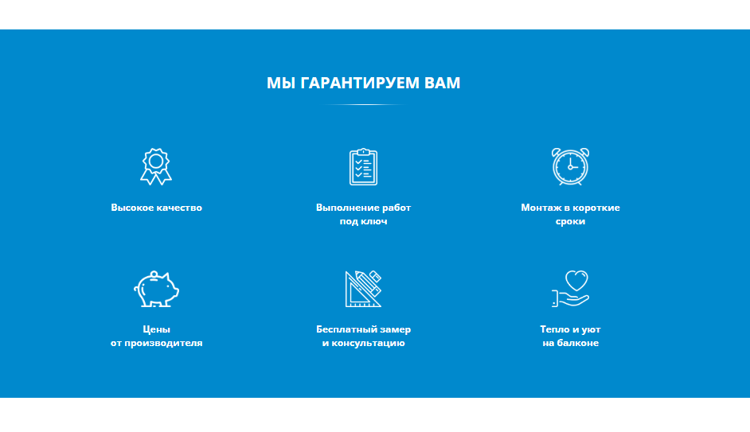
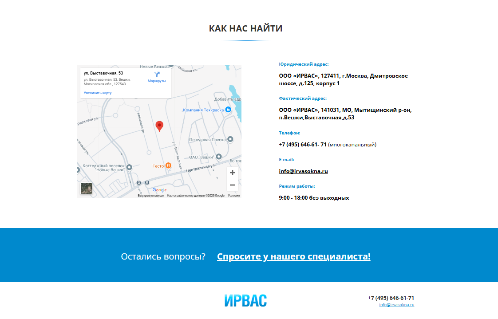

# Проект: Сайт на фрилансе

## Описание
Этот проект представляет собой веб-сайт, созданный с использованием стека технологий:

- **JavaScript**
- **Webpack**
- **HTML**
- **CSS**
- **Slick Slider**

## Установка и запуск

### 1. Клонирование репозитория
```sh
git clone https://github.com/yourusername/project-name.git
cd project-name
```

### 2. Установка зависимостей
```sh
npm install
```

### 3. Сборка проекта
#### Для разработки (hot reload, sourcemaps)
```sh
npm run build:dev
```
#### Для продакшена (минификация, оптимизация)
```sh
npm run build:prod
```

### 4. Запуск локального сервера
```sh
npm start
```

## Список картинок сайта
Изображения, использованные в проекте:
- 
- 
- 
- 
- 
- 


## Используемые библиотеки
- [Slick Slider](https://kenwheeler.github.io/slick/) – для создания слайдера
- [Webpack](https://webpack.js.org/) – для сборки проекта
